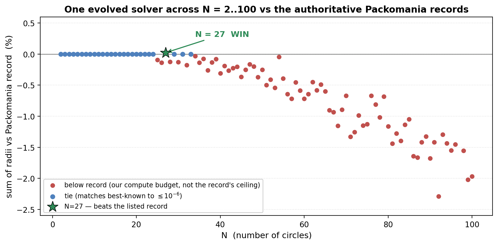
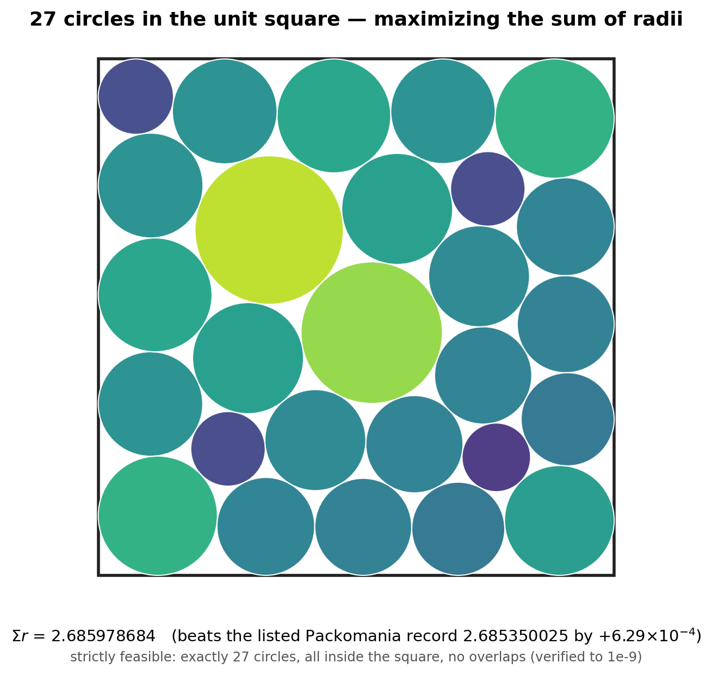
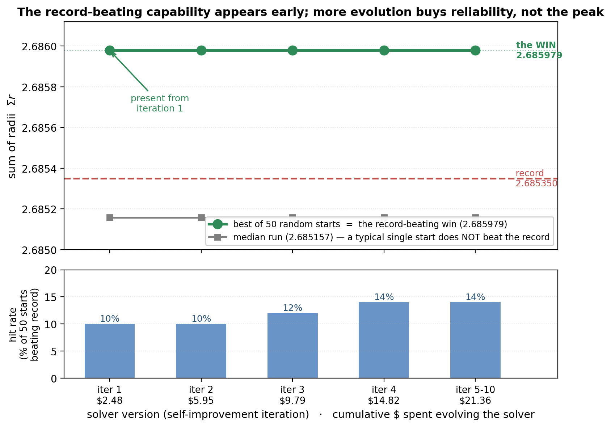

# From Answering Questions to Advancing Math: A Self-Improving AI Agent Beat a Circle-Packing Record

*Cognizant AI Lab · research note*

---

## Key takeaways

- A self-improving AI coding agent at Cognizant AI Lab wrote an optimizer that found a **new best-known** packing of 27 circles in a square, beating the value listed in Packomania, the field's authoritative reference table.

- The new configuration has sum of radii **2.685978684198** versus the listed **2.685350025228** — an improvement of **+0.000628658970 (+0.023%)**. It is a fixed, strictly-feasible artifact that anyone can independently verify from its coordinates.

- **Honest scope:** the entry we beat is the *classical baseline* in Packomania's table, **NOT** the recent AI-optimized results from Google DeepMind's AlphaEvolve or Sakana AI's ShinkaEvolve. On the famous N=26 case we *tie* the AI-optimized best-known value there (ShinkaEvolve's); we do not beat it.

- The agent did it with no copied solver code, by writing one strong solver and running it in a handful of actions and a few dollars — a different paradigm from evolutionary systems that search over hundreds of generated programs.

- The most interesting finding is about *where* the value of self-improvement lies: the record-beating capability was present in the very first, ~$2.48 iteration. The additional iterations bought reliability and generalization, not the peak result.

---

## What it is: a deceptively hard little problem

The task is easy to state and hard to solve:

> Pack **N** circles of *any* sizes into a unit square so that no two overlap and all stay inside, and make the **sum of the radii** as large as possible.

That objective — maximize the sum of radii — turns a familiar packing puzzle into a subtle optimization landscape full of local optima. It became a public yardstick for a new generation of AI systems when Google DeepMind used it as a showcase for AlphaEvolve, and Sakana AI's ShinkaEvolve and the open-source OpenEvolve followed. The definitive scorecard for "who holds the best packing for each N" is **Packomania**, a reference site maintained for decades by Dr. Eckard Specht — the same role the record books play in athletics.

We took a solver that one of our self-improvement experiments produced and ran it, unchanged, across every board size from N=2 to N=100, comparing each result against Packomania's records.



*Our evolved solver vs the authoritative Packomania records across N=2 to N=100. It ties 26 records at small/mid sizes, trails on large boards (our compute budget, not a ceiling), and beats the listed record at N=27.*

For small and mid-sized boards the solver reproduces the known optima essentially exactly (matching 26 of them to about one part in 100 billion). For large boards it falls short of the heavily hand-tuned records — from a fraction of a percent up to about 2.3% (largest at N=92), and on one size (N=97) a single run failed to return a valid packing at all — but those gaps reflect our modest compute budget, not a ceiling of the method. And at one size, it did something the reference table had not: it found a better packing.

---

## The record we broke (and the one we did not)

At N=27, our solver produced a strictly-feasible packing with sum of radii:

| | sum of radii |
|---|---|
| **ours** | **2.685978684198** |
| listed (Packomania `csqv` baseline) | 2.685350025228 |
| **gain** | **+0.000628658970  (+0.023%)** |



*The record-beating N=27 packing (circles colored by radius). Sum of radii 2.685978684198.*

"Strictly feasible" is not a figure of speech: the configuration has exactly 27 circles, every one inside the square, and no pair overlapping, verified to a tolerance of 1e-9 (and guaranteed feasible by the solver's exact-arithmetic repair step).

The scope matters, and we state it plainly. Packomania lists, for each N, the best value anyone has submitted. The N=27 entry we improved is the *classical baseline* — the value from Dr. Specht's own long-standing search program — not one of the recent AI-optimized entries. On the most famous case, N=26, the best-known value is 2.635983, set by ShinkaEvolve; there, our agent *matches* that number but does not beat it. So this is a genuine, verifiable improvement to a standing reference value, not a claim to have dethroned AlphaEvolve or ShinkaEvolve. Small, but real — and the kind of thing that, until recently, only a human expert or a purpose-built research code would produce.

We have prepared a submission of the N=27 packing to Packomania's maintainer for review; the artifact stands on its own regardless of how it was produced.

---

## How we did it: an agent that improves its own code

The solver was not written by a person. It was produced by a *self-improvement loop*: an AI coding agent (built on Anthropic's Claude) works in short iterations. Each iteration it makes one change to the solver, tests it against a fixed benchmark, records what happened, and commits the result to a git repository — git is quite literally the agent's memory. Over successive commits the code compounds into something stronger than any single edit.

We ran six of these loops in parallel as a controlled experiment, crossing two design choices: a short "values" constitution injected into the agent (cautious and consolidating, versus expansive and boundary-pushing), and a "self-modification" level ranging from frozen (the agent cannot touch its own improvement loop) through bounded to radical (free to rewrite it). The record-beating solver came from the most exploratory, radical self-modifying arm. Notably, the agents used essentially no web assistance: five of the six ran zero web searches, and the winning arm ran a single search — for a different board size — only after it had already reached the result. A fingerprint check of the generated code found no retrieved solver code, so the agent reconstructed the method from its own knowledge rather than copying a published implementation.

What did the agent actually invent? A clean, math-forward pipeline:

1. **For a *fixed* set of circle centers, the best possible radii are the answer to a small linear program** — the sum of radii is linear in the radii, and each radius is limited only by its distance to the four walls and, for each pair, by the distance between centers. That sub-problem can be solved exactly and instantly.

2. That exact "best radii" step is **wrapped inside a nonlinear search over the *center positions*** (sequential quadratic programming with hand-derived gradients), restarted from many random layouts, with basin-hopping to escape local optima.

3. A final **exact rescaling repair** guarantees every emitted packing is strictly feasible in exact arithmetic — no "almost legal" answers.

None of these ingredients is new to mathematics on its own. What is notable is that the agent assembled this particular, math-heavier combination on its own — a different recipe from the spiral/grid initialization plus local refinement plus simulated annealing used by ShinkaEvolve and OpenEvolve (AlphaEvolve's exact solver was never released) — and did so without being shown any of it.

---

## The most useful result isn't the record — it's where the value came from

Because the search uses random restarts, we could ask a sharp question: at which iteration of self-improvement does the record-beating ability actually appear, and what did each additional dollar of iteration buy? We re-ran every version of the evolved solver, from its first iteration onward, 50 random starts each, on N=27.



*The record-beating packing (green, best of 50 starts) is present from iteration 1; the median run (grey) sits just below the record; more evolution lifts the per-start hit rate 10% → 14% — reliability, not the peak.*

The record-beating packing is reachable from the *very first* iteration — the one that cost about $2.48. Every later version reaches the identical winning configuration too; roughly one in seven to one in ten random starts lands on it. What ~$12 more of self-improvement bought was not a higher peak but better *reliability*: the per-start hit rate rose from 10% to 14%, and the specific, reproducible configuration we shipped first appeared at iteration 4 (about $15 of cumulative cost). The median single run, tellingly, lands just *below* the record — so the win comes from a good method run a few times, not from luck.

This mirrors what we saw on the N=26 tie, where five of six agents matched the state-of-the-art packing at 1 to 5 iterations and $2.48 to $16.11 each. (That tie was reached by the agents' full evolved pipelines during the self-improvement runs; the single solver extracted for the public N=2 to N=100 sweep above, run at a fixed short budget, lands just under the N=26 record — the sweep and the agent runs are different experiments.) The lesson generalizes: the base model supplies the raw capability early and cheaply; the self-improvement scaffold's job is to make that capability reliable and to generalize it to new sizes and shapes. That is a more precise — and more useful — picture of what "agentic evolution" is actually for.

---

## Why it matters to industry

Most AI agents today retrieve, summarize, and recombine what is already known. The interesting frontier — the one Cognizant AI Lab has been building toward across our agentic-discovery work — is agents that produce something that was not in the answer key. A verifiable improvement to a decades-old reference table, however modest, is a concrete instance of that shift from *answering* to *discovering*.

Three implications for enterprises:

- **Cheap, autonomous method-synthesis.** The agent tied a state-of-the-art result and beat a standing baseline by writing one good solver and running it — a handful of actions and a few dollars, a different paradigm from evolving hundreds of candidate programs. (We make no cross-system cost claim; the published evolution systems report low per-task API costs of their own. The point is the autonomy and sample-efficiency of writing one strong solver.) Much of enterprise optimization — logistics and routing, chip and board layout, warehouse slotting, materials and scheduling — has the same shape as circle packing: maximize a value under hard feasibility constraints. An agent that can autonomously assemble a strong, custom solver for such a problem is directly useful.

- **Results you can verify, not just trust.** The packing is a fixed artifact checkable by a tiny, independent program that shares no code with the solver. In a landscape crowded with unverifiable AI claims, "here is the answer and here is the one-line check that it is correct" is exactly the property that makes AI output safe to act on. The packing is valid or it is not, regardless of how it was produced.

- **A clearer investment thesis for self-improving agents.** Our emergence analysis says the raw capability is largely in the base model and surfaces early; the self-improvement loop pays for *reliability and generalization*. That tells you where to spend: not on ever-larger blind search, but on the scaffolding that turns a capable model's first good idea into a dependable, transferable tool.

---

## Honest caveats (and how to check us)

- The N=27 result is a real, independently-verifiable improvement to the *listed baseline*; it is not a claim to beat the AI-optimized AlphaEvolve/ShinkaEvolve entries, and on N=26 we tie rather than beat them.
- Each of the six experimental arms is a single run; cross-arm differences (e.g., which "values" arm won) are directional, not statistically powered.
- The search is stochastic and wall-clock-budgeted, so re-running does not guarantee re-finding a given win on one seed — but the saved configuration is fixed and stays valid forever.
- The solver is not uniformly strong: on large boards it trails the records by up to ~2.3%, and on one size (N=97) a single run failed to produce any valid packing (it is omitted from the sweep figure). The N=27 result is a specific, verified win, not a claim of across-the-board superiority.
- The solver, an independent pure-standard-library verifier, and every result are openly available in this repository. Anyone can re-verify the N=27 packing from its coordinates in seconds:

```bash
python3 solver/verify_pck.py sota/ours/wins/csqv27.pck --record 2.685350025228
```

---

## The bigger picture

As AI systems become more autonomous, the question stops being how quickly they can answer what we already know, and becomes whether they can help us find what we do not. A self-improving agent nudging a standing mathematical record — and, just as importantly, telling us honestly where that ability came from and how reliable it is — is a small, verifiable step in that direction. With the right scaffolding, agents do not just retrieve the state of the art. Once in a while, they extend it.

---

*Data provenance: every number above is drawn from the committed run artifacts and the SI-v2 circle-packing study report. Sum-of-radii values, the N=27 coordinates, and the sweep comparison come from this repository (`sota/ours/comparison.md`, `sota/ours/wins/csqv27.*`); the per-iteration cost and emergence figures come from the study's cost and capability analyses. All packings were independently re-verified strictly feasible. The three figures are regenerated from the repo's own data by [`writeup/make_figs.py`](make_figs.py).*
